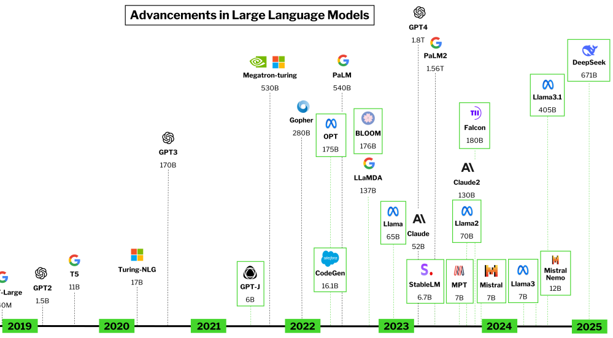

class: title-slide
background-size: contain
count: false

.center[.inline-block.size-48[]]

# Эдуард Сухарев

Семантический поиск в БД с помощью LLM

Разбираемся как на практике применять большие языковые модели, не потеряв почку и лицо.

---

background-image: url(logo.png)
background-size: 70px
background-position: calc(100% - 10px) 70px
layout: true
class: top-offset

---

.pt-10.columns-2[

  .p-8.inline-block.w-96[]
  .p-8.pt-28.text-center[
  Эдуард Сухарев

  В разработке с 2014 года

  .align-middle[.inline-block.size-5[  ]] [kraplax](https://t.me/kraplax)

  .center[.inline-block.size-48[
      [](https://t.me/php_legaciology)
  ]]
  ]
]

???

Меня зовут Эдуард Сухарев, занимаюсь разработкой и поддержкой Legacy PHP проектов с 2014 года.

---

## Как работают LLM

.pt-16.inline-block.w-full[]


???

Многие знакомы с AI ассистентами и чатботами, большинство из которых сейчас представлены нейросетью на основе большой языковой модели или LLM. Если совсем упрощённо, то это Т9 на стероидах - он видел много текстов и понимает как их дополнять. Он видел как у человеков работают вопросы и ответы и может на вопрос дать ответ, основываясь на том, что он видел. Вот например здесь мы видим набор следующих слов для такого предложения и связанные с ними вероятности появления в данном контексте.

---

## Как LLM стали большими

.-ml-5.pt-6.inline-block.w-full[]

???

Большими эти языковые модели называют не просто так: сейчас это модели в которых заложены сотни миллиардов параметров. Грубо говоря, параметры это сложные взаимосвязи между различными аспектами ввходных данных и вероятностями соответствующих выходных. Соответственно, чем больше параметров, тем больше разных нюансов взаимодействия между токенами заложено в модель. Варим борщ если речь о кулинарии, варим аргоном если контекст связан со сваркой.

---

## Специализация LLM


???

Количество параметров напрямую влияет на размер модели — чем больше параметров, тем больше и тяжелее модель. Однако неправильно было бы считать что модель тем "умнее", чем она больше — это как судить окуня по умению лазать по деревьям. У модели может быть своя специализация и разные модели подходят для разных задач.

Но как так получается? Как может модель быть заточена под узкий круг задач?

---

## Модели для кодинга

.pr-8.pt-16.inline-block.w-full[]

???

Модели учатся на примерах, в частности на текстах и примерах текстового взаимодействия. Модель может учиться на примерах кода с гитхаба, а может на русской классике. Они могут иметь схожие размеры, но быть абсолютно невзаимозаменяемыми. Разные модели могут специализироваться на разных языках программирования и показывать в них разную эффективность.

---

## Системные запросы

.pr-8.pt-6.inline-block.w-full[]

???

Кроме того, одна и та же модель может быть использована с разными системными запросами. Системный запрос - это скрытый запрос, всегда отправляемый вместе с пользовательским запросом и настраивающий LLM на определённую модель поведения. Обычно он звучит как что-то вроде "Ты  ассистент-помощник. Ты должен отвечать на вопросы пользователя честно и точно. Если ты не знаешь ответа на вопрос - ответь что не знаешь".

---

## Ограничения LLM

.col.pt-16[.left.text-s[
- Размер
- Ресурсы на обучение
- Ресурсы на использование
- Время ответа
- Поддержка языков
- Размер контекста
]]

???

У LLM есть ряд ограничений, одно из которых мы уже затронули - это количество параметров модели. Для работы модели необходимо чтобы она помещалась в память вашего сервера. У OpenAI с её гигантской ChatGPT под работу нейросети отведены десятки или сотни топовых видеокарт с огромным запасом опамяти. Наращивать эту мощность сложно и дорого.

Размер модели влияет не только на то, сколько придётся её обучать, но и на то, как быстро она будет работать - запросу нужно пройти через все уровни нейронов чтобы запрос стал "понятен" нейросети, а затем вернуться в обратную сторону ответом на основе этого запроса. Даже если у вас полно вычислительных ресурсов и памяти, большая модель будет выдавать ответ с меньшей скоростью, чем модель поменьше.

---

## Контекст LLM

.pr-8.pt-16.inline-block.w-full[]

???

Кроме этого у каждой модели есть т.н. окно контекста - то, сколько токенов (грубо говоря, слов) она может воспринимать в одном запросе. Когда задаётся новый вопрос в диалоге, вместе с ним на сервер отправляется и вся предыдущая переписка, то есть весь контекст беседы. Когда объёмы отправляемого текста начинают превышать размер контекстного окна нейросети, то она начинает "забывать" наиболее старые фрагменты переписки.

Это значит, что если необходимо заставить нейросеть обработать большой объём информации, например, скинуть ей всё содержимое Confluence или вашей папки Загрузки и спросить что-то о содержимом, то обычный диалог не подойдёт.

---

## LLM Embedding

&nbsp;

.col.pt-16[.center.text-m[
Эмбединги — вектора значений в многомерном пространстве, хранящиеся в индексе векторных СУБД
]]

???

На помощь приходят так называемые эмбединги. Если кратко, то в контексте LLM эмбединги это вектора значений в многомерном пространстве, хранящиеся в индексе векторных СУБД. Давайте попробуем разобраться что это значит.

---

## Вектора

.pt-10.columns-2[

.p-8.pt-28.text-left.text-2xl[
  .bg-emerald-300[Охота в этом году вышла отличная, настреляли много тетеревов, фазанов, видели медведя, вышел из спячки рано]
]
.p-8.pt-28.text-left[
  `[ -0.179957, -0.313618, 0.115556, 0.129781, 0.11516, 0.110949, -0.0075188, ... , 0.1210904, 0.196882]`
]
]

???

Алгоритм внутри LLM может переводить тексты в последовательность значений, где каждое значение отвечает за какой-то аспект представления о тексте. Вот такое предложение можно превратить в длинный набор чисел - так называемый вектор. У модели есть размерность ембедингов, которая определяет сколько этих чисел будет выдано на каждый текст. Что эти числа означают понять практически невозможно, да и у разных моделей их смысл и количество будут меняться.

---

## Многомерное пространство

.center[.pt-10.inline-block.w-96[]]

???

Этот вектор значений и определяет условную точку в многомерном пространстве, где по мнению модели находится смысл нашего текста. Мы все видели 1-, 2-, 3-мерное пространство, наверняка не раз видели визуализацию куба в четырёхмерном пространстве, но вектор состоит не из трёх и даже не из четырёх измерений, а из сотен и тысяч.

---

## Многомерное пространство

.pr-8.pt-16.inline-block.w-full[]

???

Кажется, что это сложно даже вообразить такое пространство. Тысячу измерений мы, кажется, представить не в силах. На самом деле, мы с вами часто сталкиваемся в реальной жизни с объектами в не меньшем количестве измерений.

---

## Многомерное пространство IRL

.pr-8.pt-16.inline-block.w-full[]

???

Это можно сравнить с созданием персонажа в RPG: каждый аспект персонажа это отдельный параметр, регулируемый ползунком в интерфейсе, а полный набор этих параметров довольно точно характеризует созданного персонажа. Каждый параметр и диапазон значений этого параметра представляет собой отдельное измерение. Ширина черепа, крючковатость носа, наличие бороды, длина волос, размер бицепса, ловкость, уровень магии, часы игрового опыта... Это всё отдельные измерения. Каждое измерение можно представить числом - цвет глаз от розового альбиноса до чёрных склер может быть последовательностью чисел от 0 до 64 например. Теперь, если собрать все вместе и договорится что порядок параметров и их количество не будут меняться, то получим вектор значений в многомерном пространстве. Теперь его не обязательно представлять как абстрактную точку в немыслимой паутине осей гиперпространства, теперь у такого вектора вполне явное представление в виде созданного персонажа.

---

## Векторы в БД

.pr-8.pt-16.inline-block.w-full[]

???

Закономерно, что если мы можем превратить текст в многомерный вектор, то мы захотим это представление сохранить для дальнейшего использования. Многие СУБД уже имеют  встроенный тип данных Vector или поддерживают его через расширения. Для СУБД PostgreSQL есть проект pgvector, который позволяет не только хранить вектора, но и делать поисковые запросы к ним.

На этой картинке не показано, но даже у SQLite есть форк с поддержкой векторов.

---

## Индекс на векторах

.col.pt-16[.left.text-s[
- HNSW (Hierarchical Navigable Small World)
- IVFFlat (Inverted File Flat)
]]

???

Где поиск в БД, там и индексы. В расширении pgvector реализовано два типа индексов: HNSW и IVFFlat.

HNSW - медленное создание, быстрый поиск. Создаёт многоуровневый граф для эффективного поиска. Может быть создан даже на пустой таблице. Ограничен размерностью вектора в 2000 измерений (или 4000 если использовать половинную точность).

IVFFlat - быстрее создаётся, требует меньше памяти. Делит вектора на списки и ищет в подмножествах этих списков. Лучше подходит для больших выборок (500+ элементов).

---

## Схожесть векторов

.col.pt-4[.left.text-s[
- Растояние городских кварталов (L1)
- Квадрат Евклидового расстояния (L2)
- Косинусное расстояние
- Скалярное произведение
]]

.pr-8.pt-2.inline-block.w-full[]

???

Но как понять что смыслы текстов похожи? как понять что "два созданных персонажа RPG похожи"? Насколько две точки в многомерном пространстве близки?

Для этого есть варианты рассчёта расстояний между точками. Первый и самый простой - расстояние городских кварталов, считается как сумма расстояние между точками по каждой из осей. В двухмерном пространстве это представляется расстоянием, которое должен проехать автомобиль из одной точки города в другую по улицам, пересекающимся под прямым углом, отсюда и название.

---

## Схожесть векторов

.col.pt-4[.left.text-s[
- Растояние городских кварталов (L1)
- .text-emerald-700[Квадрат Евклидового расстояния (L2)]
- .text-emerald-700[Косинусное расстояние]
- Скалярное произведение
]]

.pr-8.pt-2.inline-block.w-full[]

???

Для семантического поиска наиболее подходят квадрат евклидового расстояния и косинусное расстояние. Их мы и опробуем.

---

## Очень интересно

.pr-8.pl-8.pt-16.inline-block.w-full[]

???

Если вам показалось что это слишком сложно, то расслабьтесь, дальше будет проще.

---

## Пример реализации

.pr-8.pt-16.inline-block.w-full[]

---

## Нам понядобится

.col.pt-16[.left.text-s[
- `ollama` или LLM-провайдер
- эмбеддинг LLM модель
- `theodo-group/llphant`
- `pgvector/pgvector`
- *`orm/doctrine`
]]

???

А теперь к интересному - как это всё увязать в коде. Нам понадобятся пакеты `theodo-group/llphant` для базовых операций с LLM, а также `pgvector/pgvector` и `orm/doctrine` для работы с БД.

---

## Что такое Ollama

.pr-8.pt-6.inline-block.w-full[]

???

Ollama это инструмент для удобного запуска LLM на вашем железе, с поддержкой докер-лайк команд и OpenAI совместимого API.

---

## Запускаем Ollama

.pr-8.pt-6.inline-block.w-full[]
.col.pt-6[.left.text-s[
```bash
sudo service ollama start
ollama pull evilfreelancer/enbeddrus
```
]]

???

Если коротко, то достаточно просто установить Ollama и убедиться что она запущена. После этого можно стянуть доступную модель командой pull как в докере. Я выбрал модель evilfreelancer/enbeddrus, т.к. она одна из немногих эмбеддинг-моделей которая поддерживает русский язык.

---

## Настраиваем БД

.pr-8.pt-6.inline-block.w-full[]
.col.pt-6[.left.text-s[
```PostgreSQL
CREATE EXTENSION IF NOT EXISTS vector;
ALTER TABLE news_post ADD embedding vector(768);
```
]]

???

Предположим у нас уже есть таблица news_post с данными, по которым мы хотим организовать поиск. В этом примере я буду использовать PostgreSQL и расширение pgvector. Включаем расширение с помощью CREATE EXTENSION и добавляем в таблицу с данным колонку типа vector с указанием размерности вектора. Размерность вектора смотрим в параметрах модели на странице ollama.

---

## Генерируем эмбединги

.col.pt-6[.left.text-xs[
```PHP
$config = new OllamaConfig();
$config->url = $ollamaUrl;
$config->model = 'evilfreelancer/enbeddrus';
$embeddingGenerator = new OllamaEmbeddingGenerator($config);

$documents = $repository->findBy(['embedding' => null], $limit);
foreach ($documents as $document) {
    $document->embedding = $embeddingGenerator->embedText(
        $document->title . " " . $document->content
    );
}
$entityManager->flush();
```
]]

???

Далее пишем команду для пакетной обработки наших имеющихся данных для генерации эмбедингов.

---
count: false

## Генерируем эмбединги

.col.pt-6[.left.text-xs[
```PHP
$config = new OllamaConfig();
$config->url = $ollamaUrl;
$config->model = 'evilfreelancer/enbeddrus';
*$embeddingGenerator = new OllamaEmbeddingGenerator($config);

$documents = $repository->findBy(['embedding' => null], $limit);
foreach ($documents as $document) {
    $document->embedding = $embeddingGenerator->embedText(
        $document->title . " " . $document->content
    );
}
$entityManager->flush();
```
]]

???

Здесь мы видим что для этого мы используем OllamaEmbeddingGenerator из пакета llphant, в который передаём адрес нашего инстанса Ollama и используемую модель.

---
count: false

## Генерируем эмбединги

.col.pt-6[.left.text-xs[
```PHP
$config = new OllamaConfig();
$config->url = $ollamaUrl;
$config->model = 'evilfreelancer/enbeddrus';
$embeddingGenerator = new OllamaEmbeddingGenerator($config);

$documents = $repository->findBy(['embedding' => null], $limit);
foreach ($documents as $document) {
*   $document->embedding = $embeddingGenerator->embedText(
        $document->title . " " . $document->content
    );
}
$entityManager->flush();
```
]]

???

Далее выбираем из базы строчки для которых Эмбединги ещё не сгенерированы, склеиваем заголовок и содержимое поста и отправляем в генератор, который возвращает готовый вектор. Остаётся только сохранить.

---
count: false

## Генерируем эмбединги

.col.pt-6[.left.text-xs[
```PHP
$config = new OllamaConfig();
$config->url = $ollamaUrl;
$config->model = 'evilfreelancer/enbeddrus';
$embeddingGenerator = new OllamaEmbeddingGenerator($config);

$documents = $repository->findBy(['embedding' => null], $limit);
foreach ($documents as $document) {
    $document->embedding = $embeddingGenerator->embedText(
        $document->title . " " . $document->content
    );
}
$entityManager->flush();
```
]]

.col.pt-6[.left.text-xs[
```bash
bin/console app:embedding:generate -l 10000
```
]]

???

И добавим запуск с указанием размера батчей в пакетной обработке

---

## Обрабатываем запрос

.col.pt-6[.left.text-xs[
```PHP
$config = new OllamaConfig();
$config->url = $ollamaUrl;
$config->model = 'evilfreelancer/enbeddrus';
$generator = new OllamaEmbeddingGenerator($config);

$queryEmbedding = $generator->embedText($request->get('query'));

return $this->render('search/index.html.twig', [
    'documents' => $store->similaritySearch($queryEmbedding),
    'query' => $request->get('query'),
]);
```
]]

???

В контроллере мы получаем текст поискового запроса и чтобы дальше можно было искать ближайший вектор к нашему по смыслу, необходимо сначала сгенерировать вектор для нашего запроса.

---
count: false

## Обрабатываем запрос

.col.pt-6[.left.text-xs[
```PHP
$config = new OllamaConfig();
$config->url = $ollamaUrl;
$config->model = 'evilfreelancer/enbeddrus';
$generator = new OllamaEmbeddingGenerator($config);

*$queryEmbedding = $generator->embedText($request->get('query'));

return $this->render('search/index.html.twig', [
    'documents' => $store->similaritySearch($queryEmbedding),
    'query' => $request->get('query'),
]);
```
]]

???

Вот здесь мы генерируем вектор так же, как мы это делали при пакетной обработке наших постов.

---
count: false

## Обрабатываем запрос

.col.pt-6[.left.text-xs[
```PHP
$config = new OllamaConfig();
$config->url = $ollamaUrl;
$config->model = 'evilfreelancer/enbeddrus';
$generator = new OllamaEmbeddingGenerator($config);

$queryEmbedding = $generator->embedText($request->get('query'));

return $this->render('search/index.html.twig', [
*   'documents' => $store->similaritySearch($queryEmbedding),
    'query' => $request->get('query'),
]);
```
]]

???

А далее передаём созданный векто в репозиторий, ищем подходящие результаты и рендерим ответ в шаблоне.

---

## Обрабатываем запрос

.col.pt-6[.left.text-xs[
```PHP
public function similaritySearch(array $embedding, int $k = 2): array
{
    $config = $this->em->getConfiguration();
    $config->addCustomNumericFunction('cos_dist', CosineDistance::class);
    $config->addCustomNumericFunction('l2_dist', L2Distance::class);

    $repository = $this->em->getRepository(NewsPost::class);
    $embeddingAsString = VectorUtils::getVectorAsString($embedding);
    $qb = $repository
        ->createQueryBuilder('e')
        ->orderBy('cos_dist(e.embedding, :embedding)', 'ASC')
        ->setParameter('embedding', $embeddingAsString)
        ->setMaxResults($k);

    return $qb->getQuery()->getResult();
}
```
]]

???

А в самом репозитории мы можем воспользоваться Doctrine ORM QueryBuilder и построить запрос с использованием вспомогательных классов.

---
count: false

## Обрабатываем запрос

.col.pt-6[.left.text-xs[
```PHP
public function similaritySearch(array $embedding, int $k = 2): array
{
    $config = $this->em->getConfiguration();
*   $config->addCustomNumericFunction('cos_dist', CosineDistance::class);
*   $config->addCustomNumericFunction('l2_dist', L2Distance::class);

    $repository = $this->em->getRepository(NewsPost::class);
    $embeddingAsString = VectorUtils::getVectorAsString($embedding);
    $qb = $repository
        ->createQueryBuilder('e')
*       ->orderBy('cos_dist(e.embedding, :embedding)', 'ASC')
        ->setParameter('embedding', $embeddingAsString)
        ->setMaxResults($k);

    return $qb->getQuery()->getResult();
}
```
]]

???

Сначала мы регистрируем функции расчёта расстояния, предоставленные пакетом pgvector. Это позволяет использовать их в формировании запроса в QueryBuilder'е.

---
count: false

## Обрабатываем запрос

.col.pt-6[.left.text-xs[
```PHP
public function similaritySearch(array $embedding, int $k = 2): array
{
    $config = $this->em->getConfiguration();
    $config->addCustomNumericFunction('cos_dist', CosineDistance::class);
    $config->addCustomNumericFunction('l2_dist', L2Distance::class);

    $repository = $this->em->getRepository(NewsPost::class);
*   $embeddingAsString = VectorUtils::getVectorAsString($embedding);
    $qb = $this
        ->createQueryBuilder('e')
        ->orderBy('cos_dist(e.embedding, :embedding)', 'ASC')
*       ->setParameter('embedding', $embeddingAsString)
        ->setMaxResults($k);

    return $qb->getQuery()->getResult();
}
```
]]

???

А чтобы подготовить переданные эмбединги к запросу мы используем статический метод getVectorAsString класса VectorUtils пакета llphant.

---

## Результат

.pr-8.pt-16.inline-block.w-full[]

???

И вот в общем-то всё. Получаем семантический поиск. Здесь в примере видно, что поиск был сделан не по словам запроса, не по их фрагментам даже, а именно по некоторому их смысловой нагрузке. Давайте теперь попробуем оценить во что нам это может обойтись.

---

## Репозиторий

.pr-8.pt-10.flex.items-center[
.w-96[
  
]
.w-96[
  
]
]

???

И вот в общем-то всё. Получаем семантический поиск. Здесь в примере видно, что поиск был сделан не по словам запроса, не по их фрагментам даже, а именно по некоторому их смысловой нагрузке. Давайте теперь попробуем оценить во что нам это может обойтись.

---

## Оценка проекта

.columns-2[
  .pt-10.col[.left.text-s[
- качество модели
- размер модели
- размерность векторов
- быстрый CPU/GPU
- быстрый LLM API
- бесплатная модель
- бесплатная БД
- дешевый CPU/GPU
  ]]
  .w-full[
  &nbsp;

  &nbsp;

  &nbsp;

  &nbsp;

  &nbsp;

  &nbsp;

  &nbsp;

  &nbsp;

  &nbsp;

  &nbsp;

  &nbsp;

  &nbsp;

  &nbsp;
  ]
]

???

Чем можно обеспечить качество поиска? Качество будет зависеть от нашей модели, от того, на качественных ли данных она была обучена, соответствует ли она нашему языку, соответствует ли она нашей доменной области. На качество также влияет размерность векторов генерируемых моделью.

Скорость можно получить взяв быстрый CPU или GPU. В случае с моделью для эмбедингов их размер редко превышает даже 0.5 гигабайт, так что их можно гонять даже на процессорах и самых базовых видеокартах. Но добывать себе где-то железо и поддерживать его для продакшена может быть проблематично, поэтому можно воспользоваться API от OpenAPI или Anthropic, например.

А стоимость можно срезать используя бесплатные открытые модели (как я и сделал для нашего примера), взять открытую бесплатную БД и подыскать опять же дешёвый CPU/GPU.

Но, как мы видим, некоторые аспекты противоречат друг другу - быстрый CPU не бывает дешёвым, а качественные модели редко бывают в открытом доступе. Модели с векторами в 2000 и 3000 измерений доступны сегодня только по API - в открытом доступе мне попадались только размерностью до 1024, но уже без поддержки русского языка (или с незаявленной), хотя с гораздо большим размером контекста (8192 против 512 токенов).

---

## Оценка проекта

.columns-2[
  .pt-10.col[.left.text-s[
- .text-indigo-800[качество модели]
- .text-indigo-800[размер модели]
- .text-indigo-800[размерность векторов]
- .text-red-800[быстрый CPU/GPU]
- .text-red-800[быстрый LLM API]
- .text-amber-600[бесплатная модель]
- .text-amber-600[бесплатная БД]
- .text-amber-600[дешевый CPU/GPU]
  ]]

  .pt-16.inline-block.w-96[

  ]
]

???

Всем вам знакома эта диаграмма в том или ином виде, как обычно можно выбрать только 2 из 3. Давайте прикинем где мы находимся с нашим решением.

---

## Производительность

.col.pt-16[.left.text-xs[
300 постов — Apple(R) M2(TM)
]]

.pr-8.pt-16.inline-block.w-full[]


---

## Производительность

.col.pt-16[.left.text-xs[
300 постов — Intel(R) Core(TM) i7-10510U CPU @ 1.80GHz
]]
.pr-8.pt-16.inline-block.w-full[]

---

## Производительность

.col.pt-16[.left.text-xs[
300 постов — QEMU Virtual CPU version 2.5+
]]
.pr-8.pt-16.inline-block.w-full[]

---

## Требования к CPU

.col.pt-16[.left.text-s[
- Инструкции для работы с векторами и матрицами (`AVX`, `AVX2`)
- SIMD-инструкции (`AVX512` и `AMX`)
- Поддержка `HBM`
- Neural cores
]]

???

судя по всему `avx` и `avx2` это важно для скорости работы на CPU. `AVX512` и `AMX` - ещё лучше, но в линейке Intel появились только в серии Sapphire Rapids. Поддержка `HBM` также очень желательна.

---

## Качество поиска

.pr-8.pt-16.inline-block.w-full[]

???

Раз мы можем выбирать модели, то было бы логично их сравнить. Вот пример работы модели arctic-snowflake-m2 - модель чуть побольше той, что я показывал на скринах ранее, заявлена мультиязыковая поддержка, имеет размерность эмбедингов 1024, а размер контекста 8192 против 512 у предыдущей. Как видим, результат не очень и качество не сильно меняется при изменении с косинусного расстояния на L2.

---

## Качество поиска

.pr-8.pt-16.inline-block.w-full[]

???

Возьмём другую модель и качество значительно повышается. Весит столько же, размерность эмбедингов и контекста те же.

---

## Качество поиска

.col.pt-16[.left.text-s[
- Выбирайте модели не только по цифрам
- Проверяйте модель на ваших данных
- Полнотекстовый + Семантический поиск
- Создайте модель под свои нужды
- Купите/арендуйте готовую модель
]]

.col.pt-6[.left.text-m[
.text-red-700[Сменить модель — начать с нуля]
]]

???

Из этого хочется сделать следующие заключения. Только по цифрам модель выбирать не стоит, они могут отличаться во многом, в т.ч. языковой поддержкой. Важно опробовать разные варианты на своих данных, достаточно небольшой выборки. Если у вас узкая специализация или вы хотите поднять качество поиска на новый уровень - тренируйте собственную модель (делается через дотренировку базовой модели на данных вашего бизнес-домена). Если совсем ничего не помогает - попробуйте платные модели или платные API, но учтите что платить придётся всё время.

---

## Вопросы?

.pt-10.columns-2[

  .p-8.inline-block.w-96[]
  .p-8.pt-28.text-center[
  Эдуард Сухарев

  .align-middle[.inline-block.size-5[  ]] [kraplax](https://t.me/kraplax)

  .center[.inline-block.size-48[
      [](https://t.me/php_legaciology)
  ]]
  ]
]

???

На этом у меня всё. Если у вас есть вопросы, то я готов на них ответить.
